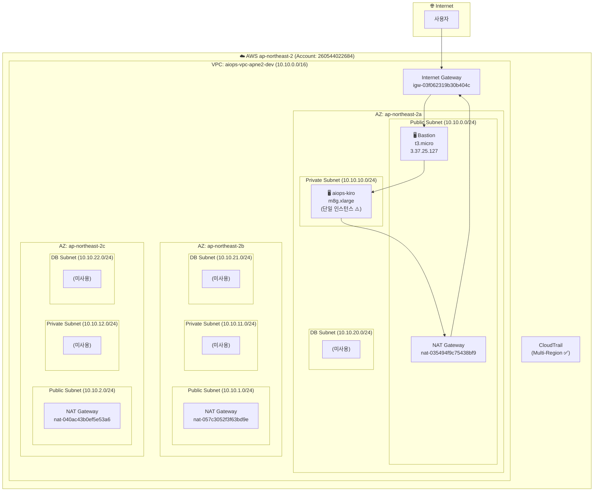
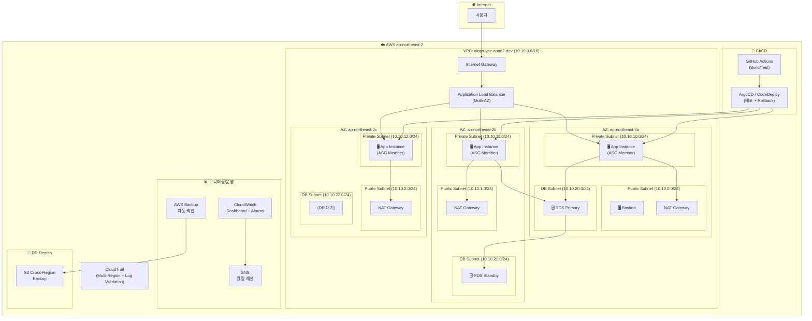

# 인프라 아키텍처 다이어그램

## 현재 아키텍처 다이어그램

## 개선 후 아키텍처 다이어그램

## 주요 변경점

| 구분 | 현재 | 개선 후 | 관련 Check ID |
|------|------|---------|--------------|
| 고가용성 | 단일 AZ(2a) EC2 1대 | Multi-AZ ASG (최소 2대) | ARCH-011, ARCH-027, ARCH-028 |
| Auto Scaling | 없음 | ASG + Target Tracking Policy | ARCH-014, ARCH-029 |
| 로드밸런서 | 없음 | ALB (Multi-AZ) | ARCH-028 |
| 모니터링 | CloudWatch Alarm 0개 | Dashboard + CPU/Memory/Disk Alarm | OPS-006, OPS-007 |
| 알림 | SNS Topic 0개 | SNS + 에스컬레이션 정책 | OPS-002 |
| 백업 | Backup Plan 0개 | AWS Backup (일일 백업, 30일 보관) | OPS-011, ARCH-030 |
| DR | 없음 | Cross-Region S3 백업 + RTO/RPO 정의 | ARCH-031, SYS-004, SYS-005 |
| CI/CD | 없음 | GitHub Actions (CI) + ArgoCD/CodeDeploy (CD) | DEV-005, DEV-011, DEV-012 |
| 장애 격리 | 없음 | Circuit Breaker 패턴 적용 | ARCH-023 |
| DB | 없음 | RDS Multi-AZ (Primary + Standby) | ARCH-011 |
| CloudTrail | Log Validation 미적용 | Log File Validation 활성화 | - |
