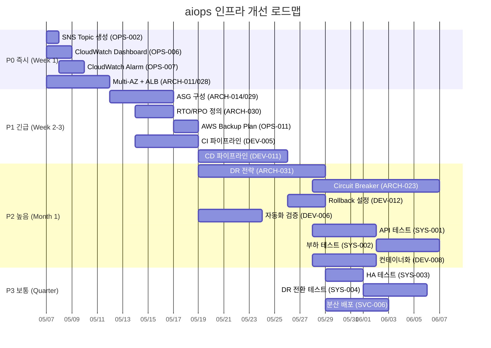

# 개선 계획

## 요약

| 우선순위 | 건수 | 목표 완료 |
|---------|------|----------|
| P0 - 즉시 | 5건 | 1주 이내 |
| P1 - 긴급 | 6건 | 2주 이내 |
| P2 - 높음 | 8건 | 1개월 이내 |
| P3 - 보통 | 8건 | 분기 내 |
| P4 - 낮음 | 11건 | 반기 내 |
| **합계** | **38건** | - |

---

## P0 - 즉시 조치 (1주 이내)

### [OPS-006] 모니터링 환경 구축
- **현재 상태**: CloudWatch Dashboard 0개, 인프라 가시성 전무
- **수정 방법**: CloudWatch Dashboard 생성 (EC2 CPU/Memory/Disk/Network 메트릭 포함)
- **예상 기간**: 1~2일
- **담당 영역**: SRE/Infra
- **리스크**: 장애 발생 시 인지 불가 → 서비스 다운타임 장기화

### [OPS-007] 임계값 감지 알람 설정
- **현재 상태**: CloudWatch Alarm 0개
- **수정 방법**: CPU ≥80%, Memory ≥85%, Disk ≥90% 알람 생성, SNS Topic 연동
- **예상 기간**: 1~2일
- **담당 영역**: SRE/Infra
- **리스크**: 리소스 고갈 사전 감지 불가

### [OPS-002] 장애 에스컬레이션 채널 구축
- **현재 상태**: SNS Topic 0개, 알림 수단 없음
- **수정 방법**: SNS Topic 생성 → Email/Slack 구독 설정 → CloudWatch Alarm 연동
- **예상 기간**: 1일
- **담당 영역**: SRE/Infra
- **리스크**: 장애 발생 시 담당자 인지 지연

### [ARCH-028] SPOF 제거
- **현재 상태**: aiops-kiro (m8g.xlarge) 단일 인스턴스로 서비스 운영
- **수정 방법**: 최소 2대 이상 인스턴스 구성 + ALB 연동, 또는 EKS 컨테이너화
- **예상 기간**: 3~5일
- **담당 영역**: Infra/Dev
- **리스크**: 단일 인스턴스 장애 시 전체 서비스 중단

### [ARCH-011] Multi-AZ HA 구성
- **현재 상태**: EC2 인스턴스 모두 ap-northeast-2a 단일 AZ에 배치
- **수정 방법**: 서비스 인스턴스를 2a/2b에 분산 배치 + ALB 구성
- **예상 기간**: 3~5일 (ARCH-028과 병행)
- **담당 영역**: Infra
- **리스크**: AZ 장애 시 전체 서비스 불가

---

## P1 - 긴급 (2주 이내)

### [ARCH-014] Auto Scaling 구성
- **현재 상태**: ASG 0개, 수동 스케일링만 가능
- **수정 방법**: ASG 생성 (min:2, desired:2, max:4) + Target Tracking Policy (CPU 70%)
- **예상 기간**: 3~5일
- **담당 영역**: Infra
- **리스크**: 트래픽 급증 시 서비스 불가

### [ARCH-029] 트래픽 급증 대비
- **현재 상태**: ASG/SQS/Karpenter 없음
- **수정 방법**: ASG 구성 (ARCH-014)으로 해결, 필요 시 SQS 버퍼링 추가
- **예상 기간**: ARCH-014에 포함
- **담당 영역**: Infra/Dev
- **리스크**: 갑작스러운 부하 증가 시 서비스 장애

### [ARCH-030] RTO/RPO 수립
- **현재 상태**: Backup Plan 0건, 복구 목표 미정의
- **수정 방법**: 서비스 SLA 기반 RTO/RPO 정의 (dev: RTO 4h/RPO 24h 권장)
- **예상 기간**: 2~3일 (문서화 + 합의)
- **담당 영역**: SRE/서비스 오너
- **리스크**: 장애 복구 시 기준 없이 대응

### [OPS-011] 백업 정책 수립
- **현재 상태**: AWS Backup Plan 0건
- **수정 방법**: AWS Backup Plan 생성 (EBS 일일 스냅샷, 7일 보관)
- **예상 기간**: 1~2일
- **담당 영역**: Infra
- **리스크**: 데이터 유실 시 복구 불가

### [DEV-005] 빌드 자동화 (CI)
- **현재 상태**: CI 도구 없음
- **수정 방법**: GitHub Actions 또는 AWS CodeBuild 파이프라인 구성
- **예상 기간**: 3~5일
- **담당 영역**: DevOps/Dev
- **리스크**: 수동 빌드로 인한 휴먼 에러, 배포 지연

### [DEV-011] 배포 파이프라인 (CD)
- **현재 상태**: CD 도구 없음
- **수정 방법**: ArgoCD 또는 AWS CodeDeploy 도입, Blue/Green 배포 전략 적용
- **예상 기간**: 5~7일
- **담당 영역**: DevOps
- **리스크**: 수동 배포로 인한 장애 위험 증가

---

## P2 - 높음 (1개월 이내)

### [ARCH-031] DR 전략 수립
- **현재 상태**: DR 인프라 없음
- **수정 방법**: 최소 Cross-Region S3 백업 구성, Terraform으로 DR 리전 인프라 코드 준비
- **예상 기간**: 1~2주
- **담당 영역**: Infra/SRE
- **리스크**: 리전 장애 시 서비스 복구 불가

### [ARCH-023] 장애 격리 설계
- **현재 상태**: Circuit Breaker 없음
- **수정 방법**: 서비스 간 통신에 Circuit Breaker 패턴 적용 (Resilience4j/Istio)
- **예상 기간**: 1~2주
- **담당 영역**: Dev/Infra
- **리스크**: 하위 서비스 장애가 전체로 전파

### [DEV-012] Rollback 메커니즘
- **현재 상태**: 미구성
- **수정 방법**: CD 파이프라인 내 자동 rollback 설정 (health check 실패 시)
- **예상 기간**: 2~3일 (DEV-011 완료 후)
- **담당 영역**: DevOps
- **리스크**: 배포 실패 시 수동 복구 필요

### [DEV-006] 자동화된 검증 절차
- **현재 상태**: CI 파이프라인 없음
- **수정 방법**: CI 파이프라인에 unit test + lint + SAST 단계 추가
- **예상 기간**: 3~5일 (DEV-005 완료 후)
- **담당 영역**: DevOps/Dev
- **리스크**: 결함 코드가 프로덕션 배포될 위험

### [SYS-001] API 기능 검증 테스트
- **현재 상태**: 미수행
- **수정 방법**: Postman/Newman 또는 pytest 기반 API 테스트 자동화
- **예상 기간**: 1주
- **담당 영역**: QA/Dev
- **리스크**: 기능 회귀 미감지

### [SYS-002] 성능검증 테스트
- **현재 상태**: 미수행
- **수정 방법**: k6/Locust 기반 부하 테스트 수행, 기준선 확보
- **예상 기간**: 1주
- **담당 영역**: QA/SRE
- **리스크**: 성능 병목 미인지 상태로 프로덕션 전환

### [SVC-004] 장애 시나리오 정의
- **현재 상태**: 미정의
- **수정 방법**: 주요 장애 시나리오 문서화 (인스턴스 다운, AZ 장애, 네트워크 단절 등) + 대응 절차 수립
- **예상 기간**: 3~5일
- **담당 영역**: SRE/서비스 오너
- **리스크**: 장애 발생 시 대응 혼란

### [DEV-008] 이미지 기반 배포
- **현재 상태**: ECR 0건, Dockerfile 없음
- **수정 방법**: Dockerfile 작성 → ECR 리포지토리 생성 → 이미지 빌드/푸시 자동화
- **예상 기간**: 3~5일
- **담당 영역**: DevOps/Dev
- **리스크**: 환경 불일치로 인한 배포 실패

---

## P3 - 보통 (분기 내)

### [SYS-003] HA 테스트
- **현재 상태**: HA 구성 없음 (P0/P1 완료 후 수행 가능)
- **수정 방법**: Multi-AZ 구성 완료 후 AZ failover 테스트 수행
- **예상 기간**: 2~3일
- **담당 영역**: SRE
- **리스크**: HA 구성의 실효성 미검증

### [SYS-004] DR 전환 테스트
- **현재 상태**: Backup 0건, DR 미구성
- **수정 방법**: DR 구성 완료 후 복구 훈련 수행, RTO 달성 여부 확인
- **예상 기간**: 3~5일
- **담당 영역**: SRE
- **리스크**: DR 전략의 실효성 미검증

### [SYS-005] RTO/RPO 목표 검증
- **현재 상태**: 미정의
- **수정 방법**: ARCH-030에서 수립한 목표를 실제 복구 훈련으로 검증
- **예상 기간**: 2~3일
- **담당 영역**: SRE
- **리스크**: 목표 대비 실제 복구 시간 괴리

### [ARCH-027] HA Multi-AZ 배포 검증
- **현재 상태**: 단일 AZ 운영
- **수정 방법**: ARCH-011 완료 후 실제 AZ 분산 배포 검증
- **예상 기간**: 1~2일
- **담당 영역**: Infra
- **리스크**: 구성만 하고 실제 동작 미확인

### [OPS-012] 데이터 분류별 백업 정책
- **현재 상태**: Backup Plan 부재
- **수정 방법**: 데이터 중요도 분류 (Critical/Important/Normal) → 분류별 보관 주기 차등 적용
- **예상 기간**: 3~5일
- **담당 영역**: SRE/DBA
- **리스크**: 불필요한 백업 비용 또는 중요 데이터 보관 부족

### [OPS-013] 인프라별 백업 방식
- **현재 상태**: 미지정
- **수정 방법**: EBS Snapshot, RDS Automated Backup, S3 Versioning 등 리소스별 방식 정의
- **예상 기간**: 2~3일
- **담당 영역**: Infra
- **리스크**: 복구 시 방식 혼란

### [SVC-006] 위험 분산 배포
- **현재 상태**: CI/CD 파이프라인 전무
- **수정 방법**: Canary 또는 Blue/Green 배포 전략 적용 (DEV-011 완료 후)
- **예상 기간**: 3~5일
- **담당 영역**: DevOps
- **리스크**: 전체 배포 실패 시 전면 장애

### [ARCH-??? 기타] 나머지 아키텍처 FAIL 항목
- **현재 상태**: 아키텍처 카테고리 내 Minor FAIL 항목들
- **수정 방법**: P0~P2 완료 후 순차 개선
- **예상 기간**: 분기 내
- **담당 영역**: Infra/Dev

---

## P4 - 낮음 (반기 내)

- N/A 항목 28건: 현재 해당 리소스가 없어 평가 불가한 항목들
- dev 환경 특성상 프로덕션 전환 시점에 재평가 필요
- EKS, RDS, ElastiCache 등 추가 리소스 도입 시 해당 체크항목 활성화

---

## 실행 로드맵



---

## 비용 영향 분석

| 항목 | 현재 (월) | 개선 후 (월) | 증감 | 비고 |
|------|----------|-------------|------|------|
| EC2 (m8g.xlarge × 1) | ~$150 | ~$300 (×2) | +$150 | Multi-AZ 이중화 |
| ALB | $0 | ~$25 | +$25 | Application Load Balancer |
| NAT Gateway (3개, 기존) | ~$100 | ~$100 | ±$0 | 이미 3 AZ 구성 |
| CloudWatch | ~$0 | ~$15 | +$15 | Dashboard + Alarm + Logs |
| AWS Backup | $0 | ~$10 | +$10 | EBS 일일 스냅샷 |
| ECR | $0 | ~$5 | +$5 | 이미지 저장소 |
| CI/CD (CodeBuild/CodeDeploy) | $0 | ~$20 | +$20 | 빌드 분당 과금 |
| **합계** | **~$250** | **~$475** | **+$225** | 약 90% 증가 |

> 💡 dev 환경 기준 월 ~$225 추가 비용 예상. 프로덕션 전환 시 인스턴스 사이즈/수량에 따라 변동.
> Reserved Instance 또는 Savings Plan 적용 시 30~40% 절감 가능.

---

## 의존관계 요약

```
OPS-002 (SNS) ← OPS-007 (Alarm) ← OPS-006 (Dashboard)
ARCH-011/028 (Multi-AZ) ← ARCH-014 (ASG) ← SYS-003 (HA 테스트)
ARCH-030 (RTO/RPO) ← OPS-011 (Backup) ← ARCH-031 (DR) ← SYS-004 (DR 테스트)
DEV-005 (CI) ← DEV-006 (검증) ← DEV-011 (CD) ← DEV-012 (Rollback) ← SVC-006 (분산배포)
DEV-008 (컨테이너화) ← DEV-011 (CD)
```

---

## 권고사항

1. **Phase 1 (P0+P1)을 2주 스프린트로 집중 실행** — 모니터링/이중화/백업은 dev 환경에서도 필수
2. **Terraform 모듈화 활용** — 기존 IaC 기반이 있으므로 모듈 추가로 빠르게 구성 가능
3. **프로덕션 전환 Gate** — P2까지 완료를 프로덕션 전환 필수 조건으로 설정
4. **분기별 ARB 재검증** — 개선 후 PASS 전환 여부 확인
