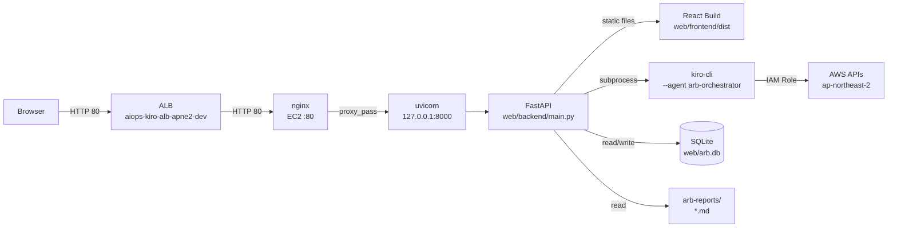
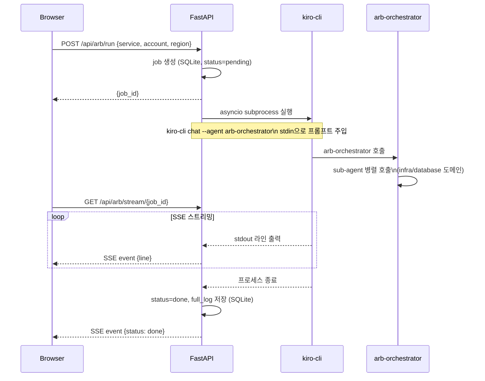

# ARB Review Web UI 구성 문서

- **작성일**: 2026-05-28
- **환경**: spay.global.dev EC2 (Amazon Linux 2023, aarch64)
- **접속 URL**: https://arb.cloud-aiops.com

---

## 1. 전체 아키텍처



### 접근 제어
- ALB Security Group: 사내 IP만 허용 (포트 80)
- EC2 IAM Role: `EC2RoleAmazonQ` (RBAC_SCOP_Q_DEVELOPER)

---

## 2. 디렉토리 구조

```
aiops-arb-kiro/
├── web/
│   ├── backend/
│   │   └── main.py          # FastAPI 애플리케이션
│   ├── frontend/
│   │   ├── src/
│   │   │   ├── main.jsx     # React 엔트리포인트
│   │   │   ├── App.jsx      # 전체 UI 컴포넌트
│   │   │   └── index.css    # 스타일
│   │   ├── dist/            # 빌드 결과물 (nginx 서빙)
│   │   ├── index.html
│   │   ├── vite.config.js
│   │   └── package.json
│   ├── arb.db               # SQLite DB (히스토리 영속 저장)
│   ├── nginx.conf           # nginx 설정
│   └── arb-backend.service  # systemd 서비스 정의
└── arb-reports/             # ARB 점검 결과 마크다운 파일
```

---

## 3. 기술 스택

| 레이어 | 기술 | 버전 | 역할 |
|--------|------|------|------|
| Web Server | nginx | 1.28.2 | 리버스 프록시, 포트 80 수신 |
| Backend | FastAPI + uvicorn | 0.128 / 0.39 | REST API, SSE 스트리밍 |
| Frontend | React + Vite | 18 / 4.5 | SPA UI |
| Markdown | react-markdown + remark-gfm | 8 / 3 | 마크다운 렌더링 |
| Diagram | mermaid.js | 10 | Mermaid 다이어그램 렌더링 |
| DB | SQLite3 | (Python 표준) | 점검 히스토리 영속 저장 |
| Process | systemd | - | 서비스 자동 시작/재시작 |

---

## 4. 백엔드 API

| Method | Path | 설명 |
|--------|------|------|
| POST | `/api/arb/run` | ARB 점검 요청, job_id 반환 |
| GET | `/api/arb/stream/{job_id}` | SSE 실시간 로그 스트리밍 |
| GET | `/api/arb/jobs` | 전체 히스토리 목록 |
| GET | `/api/arb/jobs/{job_id}` | 특정 job 상태 조회 |
| GET | `/api/arb/jobs/{job_id}/log` | 완료된 job 전체 로그 조회 |
| GET | `/api/arb/reports` | arb-reports/ 하위 md 파일 목록 |
| GET | `/api/arb/reports/content?path=` | md 파일 내용 조회 |
| GET | `/` | React 빌드 static 서빙 |

---

## 5. ARB 점검 요청 흐름



---

## 6. 실시간 로그 스트리밍 구조

- `kiro-cli` stdout을 `asyncio.create_subprocess_exec`으로 비동기 읽기
- 읽은 라인을 in-memory `LOG_BUFFERS[job_id]`에 누적
- SSE 엔드포인트에서 0.3초 간격으로 버퍼를 폴링하여 클라이언트에 전송
- 완료 후 `full_log`를 SQLite에 저장, 버퍼는 30초 후 메모리에서 제거

> **주의**: `--workers 1` 단일 프로세스로 운영. multi-worker 환경에서는 in-memory 버퍼가 worker 간 공유되지 않아 SSE 스트리밍이 동작하지 않음.

---

## 7. SQLite 스키마

```sql
CREATE TABLE jobs (
    job_id       TEXT PRIMARY KEY,
    service_name TEXT NOT NULL,
    account_id   TEXT NOT NULL,
    region       TEXT NOT NULL,
    prompt       TEXT NOT NULL,
    status       TEXT NOT NULL DEFAULT 'pending',  -- pending | running | done | error
    full_log     TEXT,
    created_at   TEXT NOT NULL,
    started_at   TEXT,
    finished_at  TEXT
)
```

DB 파일 위치: `web/arb.db`

---

## 8. UI 화면 구성

### ARB 점검 탭
- 서비스명 / 계정 ID / 리전 입력 후 점검 시작
- 실행 중 실시간 로그 스트리밍 표시
- 완료 시 status badge 업데이트

### 히스토리 탭
- 전체 점검 이력 테이블 (5초 자동 갱신)
- 각 job의 로그 버튼으로 과거 실행 로그 조회

### 리포트 탭
- `arb-reports/` 하위 md 파일 목록
- 선택 시 마크다운 렌더링 (테이블, 코드블록, Mermaid 다이어그램 포함)
- 다운로드 버튼으로 md 파일 저장

---

## 9. 서비스 관리

```bash
# 상태 확인
sudo systemctl status arb-backend
sudo systemctl status nginx

# 재시작
sudo systemctl restart arb-backend

# 실시간 로그
sudo journalctl -u arb-backend -f

# 프론트엔드 재빌드 후 반영 (코드 변경 시)
cd ~/repo/aiops-arb-kiro/web/frontend
npm run build
# → 빌드 결과가 dist/에 생성되며 서비스 재시작 없이 즉시 반영
```

---

## 10. 알려진 제약사항

| 항목 | 내용 |
|------|------|
| 동시 점검 | worker 1개이므로 동시 요청은 asyncio로 처리. 다수 동시 점검 시 kiro-cli 프로세스가 병렬 실행되어 EC2 리소스 경합 가능 |
| 진행률 | kiro-cli stdout 파싱 기반으로 정확한 % 표시 불가. AgentCore 연동 시 개선 가능 |
| 히스토리 | 서비스 재시작 시 in-memory 버퍼 초기화 (완료된 job 로그는 SQLite에 보존) |
| 인증 | 현재 사내 IP 기반 ALB SG 제어만 적용. 사용자 인증 없음 |
