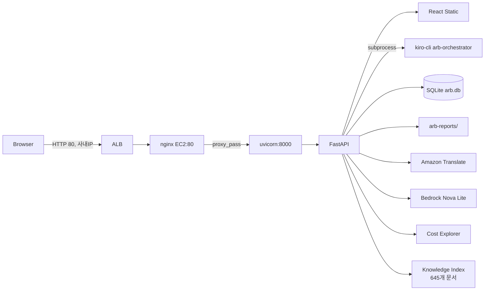
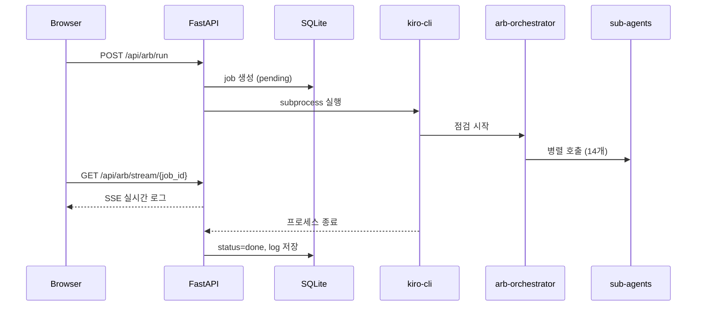

# ARB Review Web UI 구성 문서

- **최종 업데이트**: 2026-06-06
- **환경**: EC2 (Amazon Linux 2023, aarch64)
- **접속 URL**: https://arb.cloud-aiops.com

---

## 1. 전체 아키텍처



### 접근 제어
- ALB Security Group: 사내 IP만 허용 (포트 80)
- EC2 IAM Role: `EC2RoleAmazonQ`

---

## 2. 디렉토리 구조

```
aiops-arb-kiro/
├── web/                          # 실행 환경
│   ├── backend/main.py           # FastAPI 애플리케이션
│   ├── frontend/                 # React (Vite) 빌드
│   └── arb.db                   # SQLite (히스토리)
├── webfront/                     # Git 관리 소스
│   ├── backend/main.py
│   ├── frontend/src/
│   ├── nginx.conf
│   ├── arb-backend.service
│   └── README.md
├── arb-reports/                  # ARB 점검 결과 리포트
├── progress.md                   # 진행 현황
└── docs/                        # 발표 자료
    └── ARB_자동화시스템_발표자료.pptx
```

---

## 3. 기술 스택

| 레이어 | 기술 | 버전 | 역할 |
|--------|------|------|------|
| Web Server | nginx | 1.28.2 | 리버스 프록시 |
| Backend | FastAPI + uvicorn | 0.128 / 0.39 | REST API, SSE |
| Frontend | React + Vite | 18 / 4.5 | SPA |
| Chart | recharts | 2 | 대시보드 차트 |
| Markdown | react-markdown + remark-gfm + rehype-raw | 8/3/6 | 렌더링 |
| Diagram | mermaid.js | 10 | Mermaid 렌더링 |
| DB | SQLite3 | Python 표준 | 이력 영속 |
| 번역 | Amazon Translate | - | 한/영 번역 |
| AI 채팅 | Amazon Bedrock Nova Lite | - | RAG 채팅 |
| 비용 | AWS Cost Explorer | - | 비용 조회 |

---

## 4. 백엔드 API

| Method | Path | 설명 |
|--------|------|------|
| POST | `/api/arb/run` | ARB 점검 요청 |
| GET | `/api/arb/stream/{job_id}` | SSE 실시간 로그 |
| GET | `/api/arb/jobs` | 히스토리 목록 |
| GET | `/api/arb/jobs/{job_id}/log` | 실행 로그 |
| GET | `/api/arb/jobs/{job_id}/summary` | PASS/FAIL 요약 |
| GET | `/api/arb/jobs/{job_id}/reports` | 연관 리포트 목록 |
| GET | `/api/arb/reports/tree` | 프로젝트>날짜>분류 트리 |
| GET | `/api/arb/reports/content?path=&lang=` | 리포트 내용 (번역 지원) |
| GET | `/api/dashboard/projects` | 프로젝트 목록 (계정 기준) |
| GET | `/api/dashboard/trend?account_id=` | 프로젝트별 FAIL 추이 |
| GET | `/api/dashboard/monthly?month=` | 일별 점검+비용 현황 |
| GET | `/api/dashboard/cost?months=` | 연간 비용 + 과제별 횟수 |
| GET | `/api/guide/arb-tree?lang=` | ARB 카테고리 트리 |
| GET | `/api/guide/check/{check_id}` | Check ID별 관련 문서 |
| GET | `/api/guide/search?q=` | 키워드 AND 검색 |
| GET | `/api/guide/doc?file=&lang=` | 문서 내용 (번역 지원) |
| GET | `/api/guide/report-fails?path=` | FAIL Check ID 추출 |
| GET | `/api/guide/summary-fails?path=` | Summary 카테고리별 가이드 |
| POST | `/api/chat` | RAG 채팅 (Nova Lite) |

---

## 5. ARB 점검 요청 흐름



---

## 6. Knowledge 운영 가이드

- **소스**: `~/repo/aiops-arb-guide/OPSPROCESS_MD/docs/` (645개 md)
- **인덱스**: `web/backend/knowledge_index.json` (1회 생성, `build_knowledge_index.py`)
- **카테고리**: 인프라 아키텍처 / Auto Scaling / 모니터링 / 백업DR / DevOps / DB공통 / Aurora MySQL / RDS·DynamoDB
- **검색**: 키워드 AND 조합, Check ID 직접 조회
- **연동**: 리포트 FAIL 항목 → 관련 가이드 문서 자동 매핑

---

## 7. RAG 채팅

- **모델**: Amazon Nova Lite (us-east-1, Converse API)
- **컨텍스트**: Knowledge 인덱스 top-3 + 현재 리포트 발췌 3000자
- **제약**: 내부 문서 외 답변 금지 (시스템 프롬프트)
- **위치**: 리포트 탭 + 운영 가이드 탭 우측 고정 패널
- **다국어**: 한/영 언어 자동 전환

---

## 8. UI 화면 구성

### 📊 ARB 대시보드
- 연도별 월간 AWS 비용 + 일별 점검 복합 차트
- 프로젝트별 FAIL 추이 꺾은선 (점검 단위 개별 표시)
- 계정 ID 기준 중복 프로젝트 통합

### 🔍 ARB 점검
- 서비스명 / 계정 ID / 리전 입력
- 전체 리전 자동 탐지 옵션
- SSE 실시간 로그 스트리밍 (탭 이동 후에도 유지)

### 📋 히스토리
- 전체 점검 이력 테이블 (5초 자동 갱신)
- PASS/FAIL/Critical 결과 요약 열
- 로그 조회 / 리포트 바로가기

### 📄 리포트
- 프로젝트 > 날짜 > Summary / 🏗️ Infra / 🗄️ Database 트리
- 최근 summary.md 자동 로드
- 마크다운 + Mermaid + HTML 렌더링
- **summary.md**: 카테고리별 운영 가이드 버튼, ❌ FAIL 행 클릭 → 가이드 이동
- Amazon Translate 한/영 번역
- 우측 RAG 채팅 패널

### 📖 운영 가이드
- ARB 8개 카테고리 트리 (Check ID별 문서 수 배지)
- 키워드 AND 검색 (공백 구분)
- 문서 내용 한/영 번역
- 우측 RAG 채팅 패널

### 💰 비용
- 연간(1~12월) AWS 비용 바 차트
- 과제별 점검 횟수 + 최근 점검일 테이블

---

## 9. 서비스 관리

```bash
sudo systemctl status arb-backend
sudo systemctl restart arb-backend
sudo journalctl -u arb-backend -f

# Knowledge 인덱스 재생성
cd ~/repo/aiops-arb-kiro
python3 web/backend/build_knowledge_index.py

# 프론트엔드 재빌드
cd web/frontend && npm run build
```

---

## 10. 알려진 제약사항

| 항목 | 내용 |
|------|------|
| Worker | 단일 프로세스 (--workers 1), SSE 버퍼 공유 |
| 점검 시간 | 30~60분 (sub-agent 순차 실행) |
| 진행률 | kiro-cli stdout 기반, 정확한 % 불가 |
| 채팅 모델 | Nova Lite (Claude 미사용, use-case 미제출) |
| 히스토리 | 서비스 재시작 시 in-memory 버퍼 초기화 (DB 로그는 보존) |
| 인증 | 사내 IP ALB SG 제어만 적용 (사용자 인증 없음) → Backlog |
